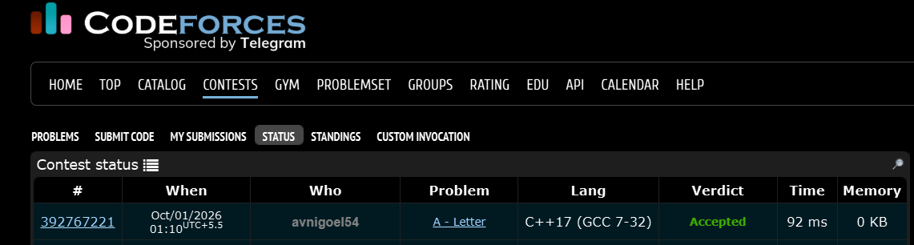

# Codeforces 14 A. **Letter**

## **Approach** - 
    -Mark empty rows & columns as removable
    -Find min & max row/column containing *
    -Print the corresponding rectangle from the original grid

## **Code** -
    
```cpp
#include <bits/stdc++.h>
using namespace std;
  int main() {
  	int n,m; cin>>n>>m;
  	char a[n][m];
  	char b[n][m];
  	for(int i=0;i<n;i++){
  	    for(int j=0;j<m; j++){cin>>a[i][j]; b[i][j]=a[i][j];}
  	}
  	for(int i=0;i<n;i++){
  	    bool abc=true;
  	    for(int j=0;j<m;j++){
  	        if(a[i][j]=='*'){abc = false; break;}
  	    }
  	    if(abc){
  	        for(int j=0;j<m;j++){
  	            a[i][j]='-';
  	        }
  	    }
  	}
  	for(int j=0;j<m;j++){
  	    bool abc=true;
  	    for(int i=0;i<n;i++){
  	        if(a[i][j]=='*'){abc = false; break;}
  	    }
  	    if(abc){
  	        for(int i=0;i<n;i++){
  	            a[i][j]='-';
  	        }
  	    }
  	}
  	int r1=n, r2=-1, c1=m, c2=-1;
      for(int i=0;i<n;i++){
          for(int j=0;j<m;j++){
              if(a[i][j]=='*'){
                  r1=min(r1,i);
                  r2=max(r2,i);
                  c1=min(c1,j);
                  c2=max(c2,j);
              }
          }
      }
  
      for(int i=r1;i<=r2;i++){
          for(int j=c1;j<=c2;j++){
              cout<<b[i][j];
          }
          cout<<endl;
      }
  
  }
```


