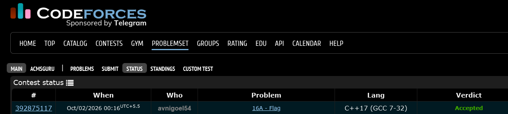

# Codeforces 16 A. **Flag**

## **Approach** - 
    -Check if all elements in each row are equal  
    -Check if consecutive rows have different values  
    -Output YES if both conditions hold, else NO

## **Code** -
    
```cpp
#include <bits/stdc++.h>
using namespace std;
  int main() {
  	int n,m; cin>>n>>m;
  	char a[n][m];
  	for(int i=0;i<n;i++){
  	    for(int j=0;j<m;j++)cin>>a[i][j];
  	}
  	bool abc=true;
  	for(int i=0;i<n;i++){
  	    char t=a[i][0];
  	    for(int j=1;j<m;j++){
  	        if(a[i][j]!=t){
  	            abc=false;
  	            break;
  	        }
  	    }
  	}
  	for(int i=1;i<n;i++){
  	    if(a[i][0]==a[i-1][0]){abc=false; break;}
  	}
  	if(abc)cout<<"YES";
  	else cout<<"NO";
  }
```


