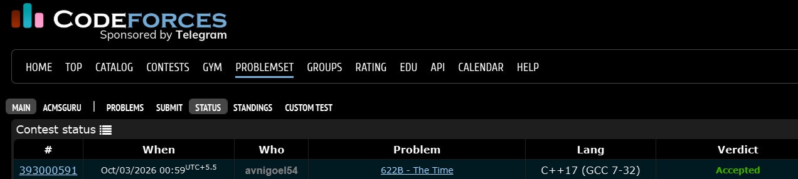

# Codeforces 622 B. **The Time**

## **Approach** - 
    -Convert added minutes within a 24-hour cycle  
    -Update hours & minutes with carry handling  
    -Format output as HH:MM with leading zeroes

## **Code** -
    
```cpp
#include <bits/stdc++.h>
using namespace std;

  int main() {
  	int h,m,a;
  	char c;
  	cin>>h>>c>>m>>a;
  	a=a%1440;
  	h=(h+(a/60))%24;
  	m=(m+(a%60));
  	if(m>=60){
  	    h++;
  	    h=h%24;
  	    m-=60;
  	}
  	cout<<setw(2)<<setfill('0')<<h<<c<<setw(2)<<setfill('0')<<m;
  }

```


