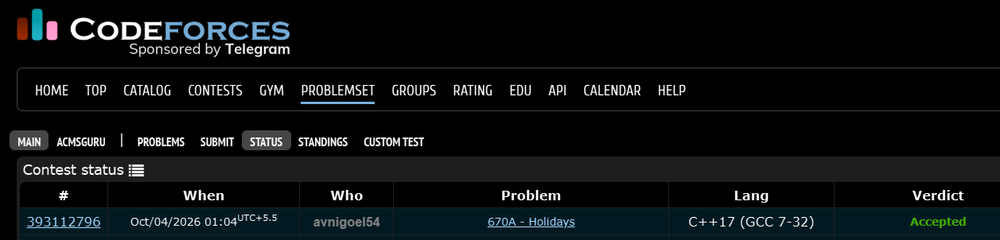

# Codeforces 670 A. **Holidays**

## **Approach** - 
    -Split n into full 7-day weeks + remaining days  
    -Calculate minimum Sundays from full weeks + remainder  
    -Calculate maximum Sundays based on remaining days

## **Code** -
    
```cpp
#include <bits/stdc++.h>
using namespace std;

  int main() {
  	int n; cin>>n;
  	cout<<(n/7*2+(n%7)/6)<<" ";
  	if(n%7>=2)cout<<(2*(n/7))+2;
  	else cout<<(2*(n/7))+(n%7);
  
  }

```


