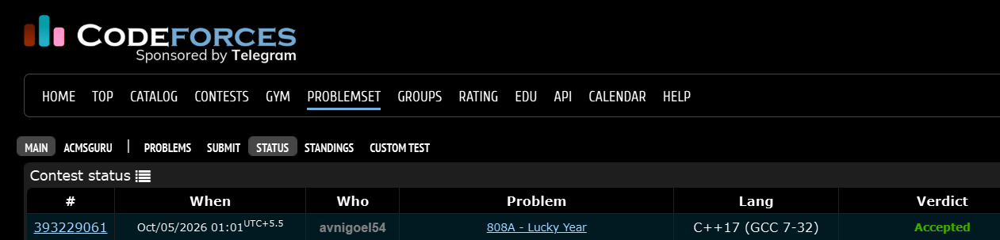

# Codeforces 808 A. **Lucky Year**

## **Approach** - 
    -Find the highest place value of n  
    -Increase the leading digit by 1 to get the next round number  
    -Output the difference between it and n

## **Code** -
    
```cpp
#include <bits/stdc++.h>
using namespace std;

  int main() {
  	long long n; cin>>n;
  	long long i=n,cnt=-1,prod=1;
  	while(i!=0){
  	    i/=10;
  	    cnt++;
  	}
  	while(cnt){
  	    prod*=10;
  	    cnt--;
  	}
  	cout<<((((n/prod)+1)*prod) - n);
  }

```


