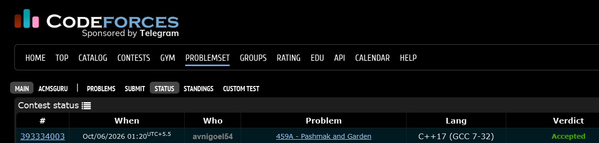

# Codeforces 459 A. **Pashmak and Garden**

## **Approach** - 
    -Check same row/column and construct the square using equal distance  
    -For diagonal points, verify |x₁−x₂| = |y₁−y₂|  
    -Output the fourth point(s), else -1

## **Code** -
    
```cpp
#include <bits/stdc++.h>
using namespace std;
  
  int main() {
  	int x1,y1,x2,y2; cin>>x1>>y1>>x2>>y2;
  	if(x1==x2){
  	    if(x1+abs(y1-y2)<=10000)cout<<x1+abs(y1-y2)<<" "<< y1<<" "<<x1+abs(y1-y2)<<" "<<y2;
  	    else cout<<x1-abs(y1-y2)<<" "<< y1<<" "<<x1-abs(y1-y2)<<" "<<y2;
  	}
  	else if(y1==y2){
  	    if(y1+abs(x1-x2)<=10000)cout<<x1<<" "<< y1+abs(x1-x2)<<" " <<x2<<" " <<y2+abs(x1-x2);
  	    else cout<<x1<<" "<< y1-abs(x1-x2)<<" " <<x2<<" " <<y2-abs(x1-x2);
  	}
  	else if(abs(x1-x2)!=abs(y1-y2))cout<<-1;
  	else{
  	    cout << x1 << " " << y2 << " "<< x2 << " " << y1;
  	}
  }

```


