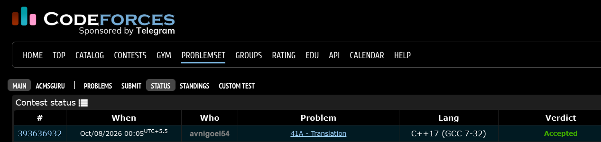

# Codeforces 41 A. **Translation**

## **Approach** - 
    -Reverse the first string  
    -Compare it with the second string  
    -Output YES if equal, else NO

## **Code** -
    
```cpp
#include <bits/stdc++.h>
using namespace std;
  
  int main() {
  	string s,t; cin>>s>>t;
  	reverse(s.begin(),s.end());
  	if(s==t)cout<<"YES";
  	else cout<<"NO";
  }

```


