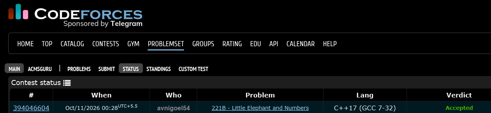

# Codeforces 221 B. **Little Elephant and Numbers**

## **Approach** - 
    -Iterate through divisors up to sqrt(n) and check both divisor pairs
    -Convert n and each divisor to strings to check for a common digit
    -Count each valid divisor once and output the total

## **Code** -
    
```cpp
#include <bits/stdc++.h>
using namespace std;

  bool common(int n,int div){
      string a=to_string(n);
      string b=to_string(div);
      for(char c:a){
          if(b.find(c)!=string::npos)return true;
      }
      return false;
  }

  int main() {
  	int n; cin>>n;
  	int cnt=0;
  	for(int i=1;1LL*i*i<=n;i++){
  	    if(n%i==0){
  	        if(common(n,i))cnt++;
  	        if(n/i!=i && common(n,n/i))cnt++;
  	    }
  	}
  	cout<<cnt;
  }


```


